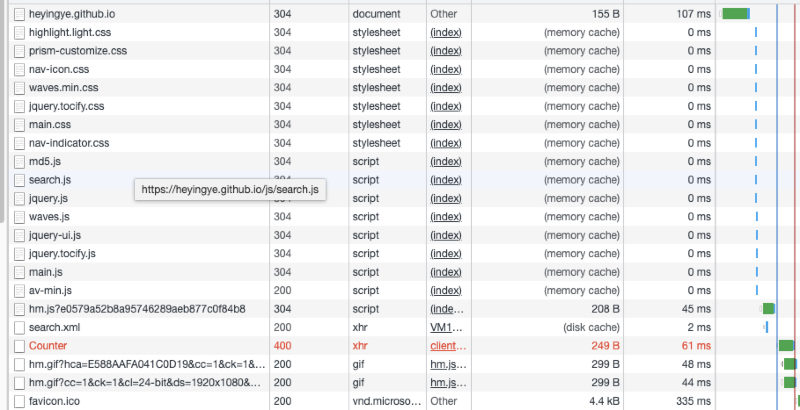

# 浏览器缓存策略

浏览器的缓存机制也就是我们常说的HTTP缓存，其机制就是根据HTTP报文的缓存标识进行的，所以在分析浏览器缓存机制之前，需要先了解httpTTP报文。
## HTTP报文
### HTTTP请求(Request)报文
报文格式为：请求行-HTTP头(通用信息头，请求头，实体头)-请求报文主体(只有POST才有报文主体)，如下图：

### HTTP响应(Response)报文
报文格式为：状态行-HTTP头(，实体头)-响应报文主体，如下图：

## 缓存过程分析

浏览器与服务器通信的方式为应答模式：即是浏览器发起HTTP请求 - 服务器响应该请求。那么浏览器第一次向服务器发起该请求后拿到请求结果，会根据响应报文中HTTP头的缓存标识，决定是否缓存结果，是则将请求结果和缓存标识存入浏览器缓存中，简单的过程如下图：

由上图可知：

- 浏览器每次发起请求，都会现在浏览器缓存中查找该请求的结果以及缓存标识
- 浏览器每次拿到返回的请求结果都会将该结果和缓存标识存入浏览器缓存中

以上两点结论就是浏览器缓存机制的关键，他确保了每个请求的缓存存入与读取，只要我们再理解浏览器缓存的使用规则，那么所有的问题就迎刃而解了，本文也将围绕着这点进行详细分析。为了方便大家理解，这里我们根据是否需要向服务器重新发起HTTP请求将缓存过程分为两个部分，分别是强制缓存和协商缓存。

### 强制缓存

强制缓存就是向浏览器缓存查找该请求结果，并根据该结果的缓存规则来决定是否使用该缓存结果的过程，强制缓存的情况主要有三种（暂不分析协商缓存过程），如下：

- 不存在该缓存结果和缓存标识，强制缓存失效，则直接向服务器发起请求（同第一次发起请求一样），如下图：

存在该缓存结果和缓存标识，但该结果已失效，强制缓存失效，则使用协商缓存（暂不分析），如下图：

存在该缓存结果和缓存标识，且该结果尚未失效，强制缓存生效，直接返回该结果，如下图：

::: tip
那么强制缓存的缓存规则是什么？
:::

当浏览器向服务器发起请求时，服务器会将缓存规则放入HTTP头中和请求结果一起返回给浏览器，控制强缓存的字段分别是**Expries**和**Cache-Control**，其中**Cache-Control**的优先级比**Expries**高。

#### Expries

Expries是HTTP/1.0控制网页缓存的字段，其值为服务器返回该请求结果缓存的到期时间，即再次发送该请求时，如果客户端的时间小于Expries的值时，直接使用缓存结果。

::: tip
Expries是HTTP/1.0的字段，但是现在浏览器默认使用的是HTTP/1.1，那么在HTTP/1.1中网页的缓存是否由Expries控制呢？
:::

到了HTTP/1.1中已经被Cache-Control替代，原因在于Expries控制缓存的时间使用了客户端的时间与服务端做对比，那么如果客户端与服务端的时间因为某些原因（例如：时区不对；客户端和服务端有一方的时间不准确）发生误差，那么强缓存则直接失效，这样的话强制缓存的存在则毫无意义，那么Cache-Control又是如何控制的呢？

#### Cache-Control

在HTTP/1.1中，Cache-Control是最重要的规则，主要用于控制网页缓存，主要取值为：

- public: 所有内容都将被缓存（客户端和服务端都可缓存）

- private: 所有内容只有客户端可以缓存，Cache-Control的默认值

- no-cache：客户端缓存内容，但是是否使用缓存则需要经过协商缓存来验证

- no-store：所有内容都不会被缓存，即不使用强缓存也不使用协商缓存

- max-age=xxx (xxx is numeric)：缓存内容将在xxx秒后失效

看一个例子，如下：

由上可知：

- HTTP响应报文expries的时间值，是一个绝对值
- HTTP响应报文中Cache-Control为max-age=600，是相对值

由于Cache-Control的优先级高于Expries，就直接使用Cache-Control的值进行缓存，也就是说在600s内再次发起该请求，则会直接使用缓存结果，强制缓存生效。

思考？🤔
::: tip
浏览器的缓存存放在哪里，如何在浏览器中判断强制缓存是否生效？
:::
如下图：

状态码为灰色的请求则代表使用了强制缓存，请求对应的Size值则代表该缓存存放的位置，分别为**memory cache** 和 **disk cache**。

::: tip
那么memory cache 和disk cache又分别代表的是什么呢？什么时候会使用from disk cache，什么时候会使用from memory cache呢？
:::

**memory cache**代表使用内存中的缓存，**disk cache**则代表使用的是硬盘中的缓存，浏览器读取缓存的顺序为memory –> disk。

### 协商缓存

协商缓存就是强制缓存失效后，浏览器携带缓存标识向服务器发起请求，由服务器根据缓存标识决定是否使用缓存的过程，主要有以下两种情况：

协商缓存生效，返回304，如下：

协商缓存失效，返回200请求结果如下：

同样，协商缓存的标识也是在响应报文的HTTP头中和请求结果返回给浏览器，控制协商缓存的字段分别有：**Last-Modified / If-Modified-Since**和**Etag / If-None-Match**，其中Etag / If-None-Match的优先级比Last-Modified / If-Modified-Since高。

#### Last-Modified / If-Modified-Since

Last-Modified是服务器响应请求的时，返回该资源文件在服务器最后被修改的时间。

If-Modifled-Since则是客户端再次发起请求时，携带上次请求返回的Last-Modified值，通过此字段值告诉服务器该资源上次请求返回的最后被修改时间。
服务器收到该请求，发现请求头含有If-Modified-Since字段，则会根据If-Modified-Since的字段值与该资源在服务器的最后被修改时间做对比，若服务器资源最后被修改时间大于f-Modified-Since的字段值，则重新返回资源，状态码为200，否则返回304，代表资源无更新，可继续使用缓存文件。

#### Etag / If-None-Match

Etag是服务器响应请求时，返回当前资源文件的一个唯一标识(由服务器生成)。

If-None-Match是客户端再次发起请求时，携带上次请求返回的唯一标识Etag值，通过此字段值告诉服务器该资源上次请求返回的唯一标识值。服务器收到该请求后，发现该请求头中含有If-None-Match，则会根据If-None-Match的字段值与该资源在服务器的Etag值做对比，一致则返回304，代表资源无更新，继续使用缓存文件；不一致则重新返回资源文件，状态码为200。

**注：Etag / If-None-Match优先级高于Last-Modified / If-Modified-Since，同时存在则只有Etag / If-None-Match生效。**

### 总结
强制缓存优先于协商缓存进行，若强制缓存(Expires和Cache-Control)生效则直接使用缓存，若不生效则进行协商缓存(Last-Modified / If-Modified-Since和Etag / If-None-Match)，协商缓存由服务器决定是否使用缓存，若协商缓存失效，那么代表该请求的缓存失效，重新获取请求结果，再存入浏览器缓存中；生效则返回304，继续使用缓存，主要过程如下：

<!-- ## 服务广西项目10.26聚餐
### 时间
2021-10-26 18:00
### 地点
竹子林地铁站B2出口，湘满楼
### 参与人员
冉阳，朱智萌，朱町忠，黎天开，陈思，
林磊， 周青青，葛果，朱蕾，陈城成，孟博，
郭鹏英，李远斌，胡啊晓（请假），谭成宇 -->

