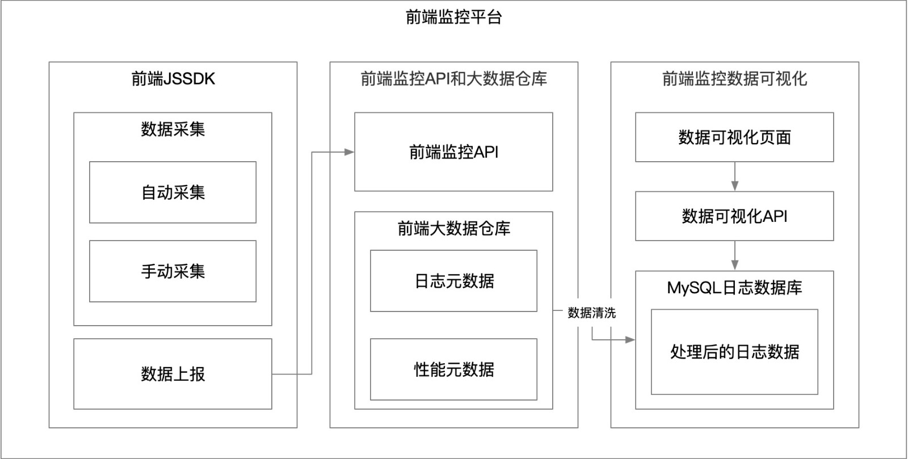
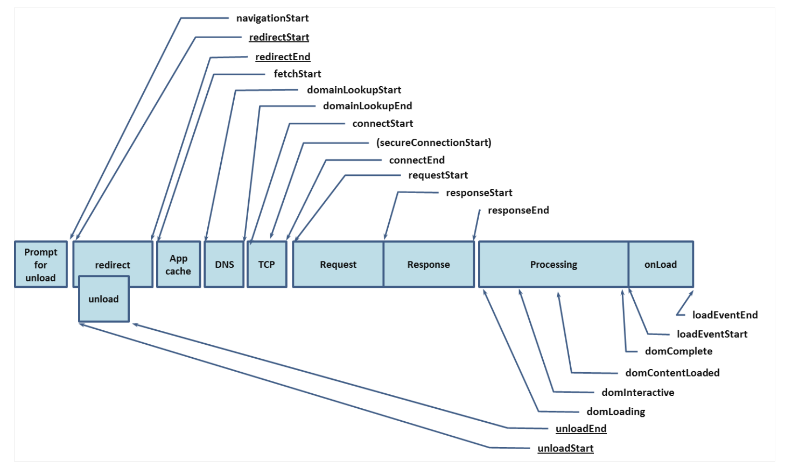
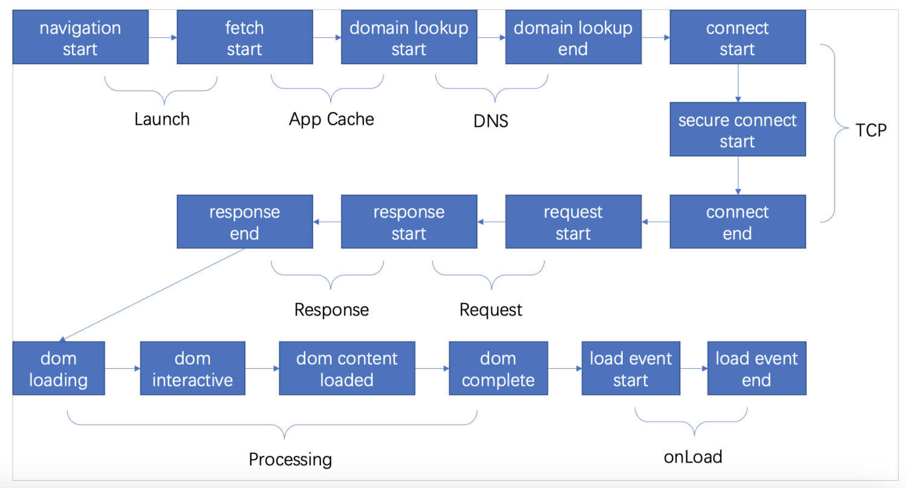

# 前端性能监控

 ## 为什么要做前端监控
 - 更快的发现问题和解决问题
 - 做产品的决策依据
 - 为业务扩展提供更多的可能性

## 前端监控目标
- 稳定性
js错误     js执行错误或者
资源异常    script和link资源加载异常
接口错误    ajax或fetch请求异常
白屏       页面空白时间

- 用户体验
加载时间                                        各个阶段的加载时间
TTFB（time to first）首字节时间                  是指浏览器发起第一个请求到数据返回第一个字节所消耗的时间，这个时间包好了网络请求
FP（first Paint）首次绘制                        首次绘制包括任何用户自定义的背景绘制，他是将第一个像素点绘制到屏幕的时间
FCP（first Content Paint）首次内容绘制            第一个dom渲染到屏幕的时间可以是文本，图片，svg等的时间
FMP（first Meaningful paint）首次有意义的绘制     首次绘制有意义的绘制是页面可用性的度量标准
FID（first input Delary）首次输入延迟            用户首次和页面交互到页面响应交互时间
卡顿                                           超过50ms的长任务

- 业务
PV             page view 页面的浏览量
UV             指访问某个站点的不同ip地址的人数
页面停留时间     用户在每个页面停留的时间

## 前端监控流程


### 搭建SDK
SDK架构图

### 错误监控SDK
#### jsError
 - 主动触发
    ```js
        window.addEventListener('error', function(e) {
            console.log(Array.prototype.slice.call(arguments)[0])
        })
        function testErr() {
            c.l = 1
        }
    ```
 - 手动触发
    ```js
     try {
        throw new Error('error!!')
    } catch(err) {
        console.log(err.message)
    }
    ```

#### promiseError

```js

  window.addEventListener('unhandledrejection', function(error) {
        // console.log(reason, promise)
        if(typeof reason === 'string') {
            // 如果是promise返回的是reject则进入这里
        } else {
            // reason.stack 可以获取到具体的错误行数
            console.log(error.reason)
        }
    })
    Promise.resolve(()=> {
        return {}
    }).then((data)=> {
        // console.log(data)
        throw new Error('error!!')
    })
```

**思考🤔:为什么window.onerror无法监控promise的错误?**

主要原因：window.onerror主要是监控宏任务的错误日志，而promsie属于微任务

### 如何监控http请求
```js
function injectXHR() {
    let XMLHttpRequest = window.XMLHttpRequest;
    let oldOpen = XMLHttpRequest.prototype.open;
     XMLHttpRequest.prototype.open = function(method, url, async) {
        // 在这里进行上报数据处理
        this.loData = {
            appid: 'app123',
            pageid: 'page123'
        }
        return oldOpen.apply(this, arguments)
     }
     let oldSend = XMLHttpRequest.prototype.send;
     XMLHttpRequest.prototype.send = function(body) {
        if(this.loData) {
            let startTime = Date.now()
            const  handler =(type)=> {
                return (event)=> {
                    let duration = Date.now - startTime;
                    let status = this.status;
                    let statusText = this.statusText;
                    // 发送数据即可
                    // ...
                }
            }
            this.addEventListener('load', handler('load'), false);
            this.addEventListener('error', handler('load'), false);
            this.addEventListener('abort', handler('load'), false);
        }
        return oldSend.apply(this, arguments)
     }     
}
```

### 白屏监控
实现思路：
- 将屏幕分成若干点这里以18个点来处理
- 获取改点下的类名或者id，如果该点返回wrapperElements则说明该处白屏，并进行一次emptyPoint++操作
- 需要注意该处调用应该是在load之后
```js

function blankScreen() {
    let emptyPoint = 0;
    // 页面的选择器
    const wrapperElements = ['html', 'body', '#main']
    const isWrapper = (element)=> {
        let selector = getSelector(element)
        if(wrapperElements.includes(selector)) {
            emptyPoint++
        }
    }
    const getSelector = (element) => {
        if(element.id) {
            return '#' + element.id;
        } else if(element.className) {
            return '.' + element.className.split(' ').join('.')
        } else {
            return element.nodeName.toLowerCase()
        }
    }
    // 将屏幕分成18个点
    for(let i=0;i<10;i++) {
        let xElements = document.elementsFromPoint(
            window.innerWidth * i / 10, window.innerHeight / 2
        )
        let yElements = document.elementsFromPoint(
            window.innerHeight * i / 10, window.innerWidth / 2
        )
        isWrapper(xElements[0])
        isWrapper(yElements[0])
    }
    // 白屏
    if(emptyPoint >= 18) {
        // 发送数据
    }
}

// load

function onload(cb) {
    if(document.readystate==='complete') {
        cb()
    } else {
        window.addEventListener('load', cb)
    }
}
onload(blankScreen)

```

[document.elementsFromPoint参考](https://developer.mozilla.org/zh-CN/docs/Web/API/Document/elementsFromPoint)

### 性能数据采集
首先我们需要知道到底到底有哪些指标

由上图我们可以计算相关的参数如：DNS解析时间，DOM加载时间等

eg: 如下我们可以获取相应的参数
```js
function getPerformance() {
    const {
        fetchStart,
        connetstart,
        connectEnd,
        requestStart,
        requestEnd,
        responseStart,
        responseEnd,
        domLoading,
        domInteractive,
        domContentLoadedEventStart,
        domContentLoadedEventEnd,
        loadEventStart
    } = widnow.performance.timing;

    return {
        connectTime: connectEnd - connetstart, //连接时间
        ttfbTime: requestEnd - requestStart, // 首字节到达时间
        responseTime: responseEnd - responseEnd, // 响应的读取时间
        parseDOMTime: loadEventStart - domLoading, // dom解析时间
        domContentLoadTime: domContentLoadedEventEnd - domContentLoadedEventStart, // dom加载时间
        timeToInteractive:  domInteractive - fetchStart, // 首次可交互时间
        loadTime: loadEventStart - fetchStart, // 完整的加载时间

    }
}
onload(getPerformance)
```

有了上面的方法介绍我们可以很轻易的获取相关参数，但是**performance.timing**并不够精确，一般使用**PerformanceObserver**;
```js
function observer_callback(list, observer) {
  list.getEntries().forEach(e => {
    console.log(e);
  });
  observer.disconnect()
}
// FP，FCP
new PerformanceObserver(observer_callback).observe({
    entryTypes: ['paint']
})
//  LCP
new PerformanceObserver(observer_callback).observe({
    entryTypes: ['largest-contentful-paint']
})
// FMP
new PerformanceObserver(observer_callback).observe({
    entryTypes: ['element']
})
// 获取FMP需要给指定的dom添加参数
// dom.setAttribute("elementtiming","meaningful")
// FID  首次输入延迟
new PerformanceObserver(observer_callback).observe({
    entryTypes: ['first-input']
})
// source
new PerformanceObserver(observer_callback).observe({
    entryTypes: ['source']
})
```

[performance.timing文档](https://developer.mozilla.org/zh-CN/docs/Web/API/PerformanceTiming)
[PerformanceObserver文档](https://developer.mozilla.org/zh-CN/docs/Web/API/PerformanceObserver/PerformanceObserver)

### 曝光采集

实现曝光一般使用**IntersectionObserver**实现，当然除了该API浏览器也提供了其他的API

扩展知识
- IntersectionObserver 
    监听一个元素和可视区域相交部分的比例，然后在可视比例达到某个阈值的时候触发回调
- MutationObserver
    监听 DOM 树的变化（属性、子节点的增删改）比如我们可以去做回溯
- PerformanceObserver 
    用于监测性能度量事件，在浏览器的性能时间轴记录下一个新的 performance entries 的时候将会被通知。可以监控性能

- ResizeObserver 
    接口可以监听到 DOM 的变化（节点的出现和隐藏，节点大小的变化）
- ReportingObserver
    ReportingObserver: 监听过时的 api、浏览器的一些干预行为的报告

```js

    export function collectAppear() {
  const appearEvent = new CustomEvent('onAppear');
  const disappearEvent = new CustomEvent('onDisappear');
  let ob;
  if (window.ImoocCliMonitorObserver) {
    ob = window.ImoocCliMonitorObserver;
  } else {
    ob = new IntersectionObserver(function(e) {
      e.forEach(d => {
        if (d.intersectionRatio > 0) {
          console.log(d.target.className + ' appear');
          d.target.dispatchEvent(appearEvent);
        } else {
          console.log(d.target.className + ' disappear');
          d.target.dispatchEvent(disappearEvent);
        }
      });
    });
  }
  let obList = [];
  const appear = document.querySelectorAll('[appear]');
  for (let i = 0; i < appear.length; i++) {
    if (!obList.includes(appear[i])) {
      ob.observe(appear[i]);
      obList.push(appear[i]);
    }
  }
  window.MonitorObserver = ob;
  window.MonitorObserverList = obList;
}


document.getElementsByClassName('demo2')[0].addEventListener('onAppear', function(e) {
    // sendExp({ a: 1, b: 2 }, e);
  });

```

